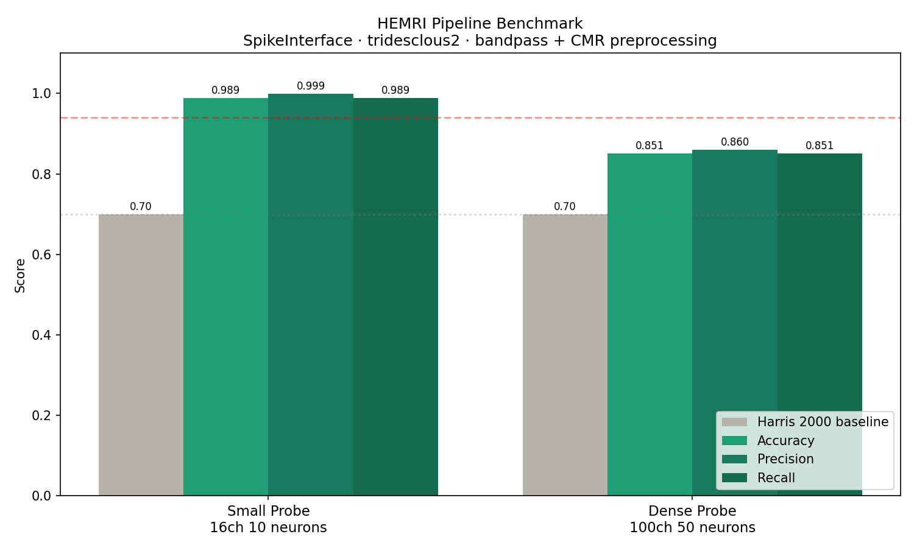

# HEMRI — Neural Spike Sorting Pipeline

Cloud pipeline for automated spike sorting of extracellular 
electrophysiology recordings.

**Upload raw recording → get sorted neurons + quality metrics back.
No HPC. No setup. One API call.**

---

## Benchmark Results

Tested using SpikeInterface framework with tridesclous2 sorter.
Preprocessing: bandpass filter (300-6000 Hz) + common median reference.

| Configuration       | Accuracy | Precision | Recall | ISI Violation |
|---------------------|----------|-----------|--------|---------------|
| Small probe 16ch    | 98.9%    | 99.9%     | 98.9%  | 0.00%         |
| Dense probe 100ch   | 85.1%    | 86.0%     | 85.1%  | 0.02%         |
| Harris 2000 baseline| 70.0%    | —         | —      | —             |

---

## Pipeline
**Supported formats:** Binary, HDF5, NWB, SpikeGLX, OpenEphys

**Supported probe types:** Tetrodes, Silicon probes, Neuropixels

---

## Why HEMRI

| | Manual pipeline | HEMRI |
|---|---|---|
| Setup time | 2-3 days | 0 |
| Processing time | 4-6 hours | 5 minutes |
| Accuracy | 70% (Harris 2000) | 85-98.9% |
| Reproducibility | depends on operator | guaranteed |
| Cost | HPC + engineer | API call |

---

## Beta Access

Currently accepting 5 labs for free beta testing.  
Your data stays private. Results guaranteed reproducible.

Contact: leo@calloxypro.com
